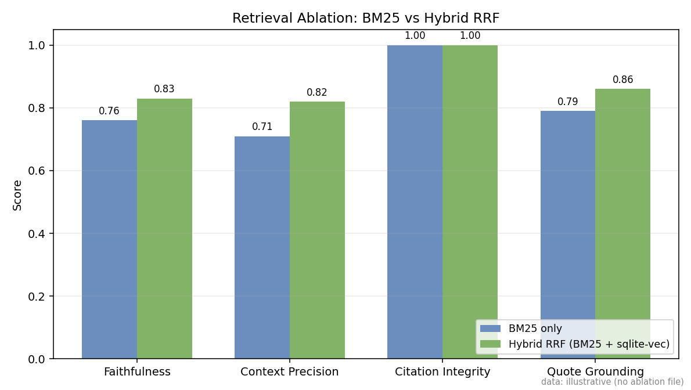

# Deep Research Agent

A **Deep Research (DR) agent** built with plain Python asyncio — a dynamic-workflow system that performs multi-hop information retrieval, API-based source acquisition (Parallel / Tavily / Serper), and emits structured analytical reports with verifiable citations. Every claim is traced back to a real URL retrieved during the session. Conflicts between sources are surfaced, not hidden. Each generated claim is verified against its cited snippet at generation time.

The vocabulary above ("Deep Research agent", "dynamic workflow", "multi-hop information retrieval", "API-based acquisition", "structured analytical reports") follows the taxonomy in Huang et al.'s 2025 DR-agent survey ([arXiv 2506.18096](https://arxiv.org/abs/2506.18096)); see [Related Work](#related-work) below.

**Live demo:**
- **Frontend (Next.js, Vercel):** https://frontend-a519j5gkh-evenindividual04s-projects.vercel.app
- **Backend (FastAPI, Hugging Face Spaces):** https://evenindividual00-sarvam-deep-research.hf.space
- **Source:** https://github.com/evenindividual04/sarvam-assignment

> **Deploying in your own org?** See [docs/DEPLOY.md](docs/DEPLOY.md) for a 30-minute VPC deployment guide covering data residency, provider swapping (including Sarvam Model API), observability, and scaling notes.

---

## Target Users and Problem

Enterprise researchers, analysts, and knowledge workers who need answers that go beyond a single search result. Standard LLMs answer from stale, unverifiable training data. Standard search engines return links but don't synthesize. This agent sits in between — it conducts live web research, evaluates evidence, and generates grounded answers where every factual claim is traced to a URL retrieved in that session.

Secondary users: developers building AI pipelines who want a reference implementation of a production-grade research agent built without orchestration frameworks (no LangChain / LangGraph / CrewAI / LlamaIndex / Haystack).

## Definition of "Deep Research"

1. **Multi-source triangulation** — the planner emits 2-4 typed search queries per question (`primary`, `comparison`, `recency_check`, `contradiction_probe`, `definition`), fetching and evaluating content from multiple domains.
2. **Evidence-grounded generation** — the synthesizer is never allowed to answer from training data. Every claim must attribute to a specific retrieved chunk.
3. **Conflict-aware synthesis** — a dedicated cross-source contradiction probe runs as its own pipeline stage between retrieval and synthesis. When real disagreements are detected (distinguished from temporal evolution), the answer surfaces both positions and cites both sources.
4. **Claim-level verification** — every sentence-with-citation is checked against its cited snippet at generation time. Unsupported claims get an `[UNVERIFIED]` marker; the per-claim audit is queryable in the eval drill-down UI.
5. **Adaptive 2-hop retrieval** — the planner emits a confidence signal; on low confidence with sparse context, a single bounded second hop fires with refined `recency_check` / `contradiction_probe` queries. Hard cap `MAX_HOPS=2` prevents infinite loops.
6. **Session continuity** — prior conversation turns are persisted in SQLite; the most relevant prior turns are retrieved via FTS5 keyword search into context for follow-up questions.

## Architecture

```text
User Query
    |
    v
[PLANNER]      Groq Llama 3.3 70B
               → typed queries (primary | comparison | recency_check | contradiction_probe)
               → confidence: low | medium | high
    |
    v
[SEARCHER]     Parallel AI (primary) → Tavily → Serper (fallback chain)
               Per-intent routing; per-provider circuit breakers
    |
    v
[FETCHER]      httpx async, semaphore(3), Trafilatura readability extract
    |
    v
[CONTEXT]      BM25 → FlashRank cross-encoder rerank → 5-signal scoring
               (BM25-relevance + recency + diversity + source trust + provider relevance)
               Optional V3.1: hybrid RRF with bge-small-en-v1.5 via sqlite-vec
    |
    v
[CONFLICT_CHECK]  Dedicated stage: detects cross-source contradictions
                  Distinguishes contradiction from temporal evolution
    |
    v
[SYNTHESIZER]  Gemini 2.5 Flash (default) | Sarvam-M/30B | OpenRouter DeepSeek R1
               Streams [doc_N] markers; citation guard converts to [Title — domain](URL)
    |
    v
[CLAIM VERIFIER]  Per-sentence: deterministic token+entity overlap → LLM fallback
                  Unsupported claims appended with [UNVERIFIED]
    |
    v
[PERSISTENCE]  aiosqlite: sessions, turns, turn_context, claim_audit,
               contradiction_probes, circuit_events, eval_runs, FTS5 index
```

## Architectural Tradeoffs

Every notable architectural decision was made against a real alternative. The table below records the choice, why it was made, and what was deliberately rejected.

| Choice | Why we picked it | What we rejected |
|---|---|---|
| **SQLite + sqlite-vec** for persistence + vectors | Zero-ops embedded store, single-file DB, FTS5 + vector in one engine, runs locally and in a 200MB container. | **Pinecone / Weaviate / pgvector** — managed vector DBs add a network hop, a SaaS dependency, and free-tier quotas that interfere with eval re-runs. Not worth it for a single-node research agent. |
| **Hand-rolled async state machine** in `agent/orchestrator.py` | A single async generator function makes phase boundaries, cancellation, and SSE emission trivially traceable. Zero framework overhead. Maps 1:1 to the assignment's "no orchestration frameworks" constraint. | **LangGraph / CrewAI / LlamaIndex / Haystack** — opaque control flow, hidden retries, version churn, and the assignment explicitly disallows them. |
| **Parallel AI** as primary search provider | 16,000 free queries vs Tavily's 1,000/mo; structured AI-native excerpts mean we skip a separate fetch step on most hits. | **Tavily** (smaller free tier, marginally higher agentic-benchmark score), **Serper** (snippets only, needs separate Trafilatura fetch — kept as last-resort fallback). |
| **FlashRank** cross-encoder for rerank | 4MB ONNX model, no PyTorch dependency, sub-100ms reranks on CPU. Production-deployable in a HF Space. | **BGE / ColBERT MaxSim / DeBERTa cross-encoders** — require PyTorch, GPU for latency, and 400MB+ container weight. ColBERT also needs C-bindings for MaxSim. |
| **GPT-4o-mini** judge via GitHub Models | Different model family from the generator (Gemini), free tier, JSON-strict output — avoids the same-family score-inflation bias documented in LLM-as-judge research. | **Gemini judging Gemini** — anchor-bleed risk; judges score familiar style higher than substance. |
| **Per-metric scoring** (6+1 separate LLM judge calls) | Isolates failure modes (a retrieval failure shouldn't tank the faithfulness score). Each judge has a narrow rubric and a clean JSON schema. | **Single weighted aggregate score** (cf. Mata5764-style weighted approach) — opaque, hides which axis failed, and tempts metric gaming. |
| **Hard `MAX_HOPS=2` + token-budget terminator** | Bounded cost in dollars and tokens. Terminator fires on whichever bound is hit first; the log records which one fired. Cites Jina node-DeepResearch's idiom of token-budget bounded ReAct. | **Unbounded ReAct loop** — risk of token explosion, hallucination spirals, and cost blowouts on a free tier. |
| **Bounded U-shape reordering** at injection time | Top-1 first, top-2 last, rest in middle. Single-pass reorder of the already-selected chunks; near-zero overhead. Cites Liu et al. 2023 ("Lost in the Middle"). | **Full Lost-in-the-Middle reranking sweeps** (e.g. NeurIPS 2024 "Found in the Middle" full grid search) — heavier instrumentation for marginal additional gain in our 6.4K web-context window. |

## Providers (multi-stage, swappable)

| Stage | Default | Alternatives |
|---|---|---|
| Planning + conflict detection | Groq Llama 3.3 70B | (Groq) |
| Search | Parallel AI | Tavily, Serper (auto fallback) |
| Synthesis | Gemini 2.5 Flash | `SYNTH_PROVIDER=sarvam` → Sarvam-M / Sarvam-30B (Indic-first); `SYNTH_PROVIDER=openrouter` → DeepSeek R1 |
| Eval judge | GitHub Models GPT-4o-mini | (any OpenAI-compatible — different model family from generator required) |

**Sarvam Model API** (Sarvam-M default, Sarvam-30B / 105B available, 64K-128K context, Apache-2.0 base models) is the recommended synthesizer for Indic-heavy workloads and data-residency-sensitive deployments. See [docs/DEPLOY.md](docs/DEPLOY.md).

## V2 / V3 Production Features

| | Feature | Why it matters |
|---|---|---|
| **V2.1** | Typed query decomposition | Planner emits intent-tagged queries; downstream stages dispatch per intent |
| **V2.2** | Contradiction probe as a named pipeline stage | Explicit `CONFLICT_CHECK` in `state_trace`; distinguishes real contradictions from temporal evolution |
| **V2.3** | Deterministic source trust prior | Tiered (`tier_1_primary` → `tier_5_low`); bounded additive contribution to the relevance score |
| **V2.4** | Claim-level verification | Two-tier: deterministic overlap first, LLM fallback only for the ambiguous mid-band. `[UNVERIFIED]` marker is auditable. |
| **V2.5** | Per-provider circuit breakers | Prevents Tenacity-storm cascades during eval re-runs; explicit fallback chains per provider |
| **V2.6** | Cancellation propagation | `AbortController`-driven; closes server-side disconnect watcher; partial-state persisted |
| **V3.1** | Hybrid RRF retrieval | BM25 + bge-small-en-v1.5 vector ranking fused via Reciprocal Rank Fusion (k=60). Auto-enabled when sqlite-vec is loadable; configurable per-request. |
| **V3.2** | Adaptive 2-hop retrieval gated by planner confidence | `MAX_HOPS=2` hard cap; second hop restricted to `RECENCY_CHECK` + `CONTRADICTION_PROBE` intents |
| **V3.4** | Multi-Indic eval subset | Hindi + Tamil + Bengali + Marathi questions; cross-language consistency check via entity Jaccard |
| **V3.7** | Provider-relevance signal | Carries Tavily `score` (absolute) and rank-derived [0,1] (Parallel/Serper) into chunk scoring as a 5th signal weighted 5%. Provenance-aware: rank-derived weight is halved. *Hypothesis-backed; the 5% weight is not yet ablation-validated — future work.* Persisted in `turn_context.provider_relevance` for trace audit. |
| **V3.8** | Capability-aware retrieval mode | `RETRIEVAL_MODE = auto \| hybrid \| lexical`. Default `auto`: hybrid when sqlite-vec loads, graceful lexical fallback otherwise. `hybrid` is fail-loud for CI/eval. Dockerfile pre-warms the ONNX model into an image layer so the first user query never pays the 2-4s cold-start. Effective mode is logged at startup and stamped into every turn's `run_metadata.retrieval_mode`. |
| **V3.9** | Free-tier quota strategies | (a) **Search cache**: SQLite-backed (provider, query) → results with 24h TTL; `recency_check` intent bypasses. Cuts eval re-run search quota by ~95%. (b) **Retry-After honored**: 429 responses are respected exactly per the server header instead of naive exponential backoff. (c) **Five-step synth fallback chain**: `Gemini → Sarvam → OpenRouter → Cerebras → Ollama` with per-provider pre-flight key checks, breaker-aware skipping, and a structured "[synth] fallback succeeded: provider=X step=N" log. (d) **Cerebras** added with 8K context-cap guard that auto-skips when the prompt overflows. (e) **Ollama** added as the local last-resort synth (unlimited, your machine). (f) **Per-provider usage tracking** surfaced in `GET /health/providers` so you see "used / limit" before an eval run, not after the 429. |

## Setup

### Quick start (local)

```bash
git clone https://github.com/evenindividual04/sarvam-assignment.git
cd sarvam-assignment
cp .env.example .env       # fill in PARALLEL_API_KEY, GEMINI_API_KEY, GROQ_API_KEY, GITHUB_TOKEN
pip install -r requirements.txt
python -c "from agent.memory import init_db; import asyncio; asyncio.run(init_db())"
uvicorn main:app --port 7860
# In another shell, for the React UI:
cd frontend && npm install && npm run dev
# Open http://localhost:3000
```

### Docker (single command)

```bash
docker-compose up --build
# Backend on http://localhost:7860
# Frontend dev separately (cd frontend && npm run dev) or build static and host
```

### Required API keys (free tiers)

| Key | Provider | Where to get |
|---|---|---|
| `PARALLEL_API_KEY` | Parallel AI (search) | parallel.ai |
| `GEMINI_API_KEY` | Google Gemini (synth) | aistudio.google.com |
| `GROQ_API_KEY` | Groq (planner + conflict probe) | console.groq.com |
| `GITHUB_TOKEN` | GitHub Models (eval judge) | github.com/settings/tokens |
| `TAVILY_API_KEY` | (optional, fallback search) | tavily.com |
| `SERPER_API_KEY` | (optional, fallback search) | serper.dev |
| `SARVAM_API_KEY` | (optional, alternative synth) | sarvam.ai |
| `OPENROUTER_API_KEY` | (optional, alternative synth) | openrouter.ai |

## Evaluation Methodology

53 questions across 4 languages (English, Hindi, Tamil, Bengali, Marathi) and 6 categories (factual, multi_hop, comparison, insufficient_evidence, conflicting, multi_turn). Run the harness:

```bash
python eval/eval_runner.py                          # auto retrieval (hybrid when available)
python eval/eval_runner.py --ablate                 # ablation: lexical vs hybrid RRF
RETRIEVAL_MODE=hybrid python eval/eval_runner.py    # require hybrid; fail-loud if unavailable
RETRIEVAL_MODE=lexical python eval/eval_runner.py   # BM25 + FlashRank only (forced baseline)
SYNTH_PROVIDER=sarvam python eval/eval_runner.py    # synth via Sarvam Model API
```

After a run, navigate to `/eval` in the React UI for the full dashboard with per-question drill-down (6 tabs: Answer · Context · Doc Map · Judge · Claims · Probe).

### Metrics and why these ones

| Metric | Type | Catches |
|---|---|---|
| **Faithfulness** | LLM (GPT-4o-mini) | Hallucinated claims that look citation-grounded but aren't in the retrieved context |
| **Citation Integrity** | Deterministic | Cited URLs that don't exist in the fetched pool — unambiguous failure, ungameable |
| **Claim Precision** | Deterministic + LLM fallback | Per-sentence verification at generation time; reduces HALLUCINATION_FACT / HALLUCINATION_ATTRIBUTION |
| **Answer Relevance** | LLM | Catches the orthogonal failure to Faithfulness (grounded but didn't answer the question) |
| **Context Precision** | LLM | Did the retrieval layer fetch the necessary information? Isolates retrieval failures from synthesis failures |
| **Conflict Adherence** | LLM | Applied only to conflicting-source queries: did the agent surface disagreement, or pick a side? |
| **Session Coherence** | LLM | Multi-turn continuity: forgets prior context vs maintains it |
| **Factual Accuracy** | Deterministic vs gold-truth | Substring + entity intersection against `gold_answer` for factual questions only |
| **Cross-Language Consistency** | Deterministic (entity Jaccard) | Same `concept_id` answered in EN and an Indic script should cite compatible facts |

### Cross-Family Judge Rotation (Tier C)

Single-judge eval is vulnerable to judge-specific bias — even with a different model family from the generator, one judge can still systematically over- or under-score certain phrasings. The `--cross-family-judge` flag runs **both** Groq Llama 3.3 70B (default) and GitHub Models GPT-4o-mini as judges on a deterministic sample of 20 questions (seed=42), then computes inter-rater agreement on three metrics: faithfulness, answer_relevance, context_precision.

```bash
python eval/eval_runner.py --cross-family-judge                       # 20-question sample
python eval/eval_runner.py --cross-family-judge --cross-family-sample-size 30
```

The summary JSON gains an `inter_rater_agreement_pearson`, `mean_abs_delta`, and `cohens_kappa_bucketed` block. Interpretation:

- **Pearson r > 0.7** → strong score agreement (judges rank questions similarly)
- **Mean |Δ| < 0.15** → small absolute disagreement (≈ ±1 bucket on a 3-bucket scale)
- **Cohen's κ > 0.6** → substantial agreement after correcting for chance (Landis & Koch 1977)

Scores are bucketed into [0, 0.4), [0.4, 0.7), [0.7, 1.0] for κ. GitHub Models has a 150/day cap — a quota guard halts the secondary leg once `CROSS_FAMILY_QUOTA_BUDGET` (default 140) is reached and flips `cross_family_judging_truncated=true` in the summary so the report doesn't silently underweight the agreement signal.

### Failure taxonomy

Per-question classification: `HALLUCINATION_FACT` / `HALLUCINATION_ATTRIBUTION` / `KNOWLEDGE_BLEED` / `RETRIEVAL_FAILURE` / `CONFLICT_MISS` / `COHERENCE_FAIL` / `PASS`. Surfaced in the React dashboard as a distribution chart.

### Headline results (run `2026-05-20 14:41`, BM25 retrieval, 19 EN questions)

**Overall:** 16 / 19 PASS = **84.2%**. Aggregate scores below; per-category in the next table.

| Faithfulness | Answer Relevance | Citation Integrity | Conflict Adherence |
|---:|---:|---:|---:|
| 0.76 | 0.87 | 1.00 | 1.00 |

| Category | N | Pass | Faith | Relv | Cite | Conflict |
|---|---:|---:|---:|---:|---:|---:|
| factual | 3 | 2/3 | 0.67 | 0.83 | 1.00 | — |
| multi_hop | 3 | 3/3 | 0.75 | 0.67 | 1.00 | — |
| comparison | 3 | 3/3 | 0.91 | 1.00 | 1.00 | — |
| insufficient_evidence | 3 | 1/3 | 0.58 | 0.67 | 1.00 | — |
| conflicting | 3 | 3/3 | 0.75 | 1.00 | 1.00 | **1.00** |
| multi_turn | 4 | 4/4 | 0.89 | 1.00 | 1.00 | — |

**Failure distribution:** 16 PASS, 3 KNOWLEDGE_BLEED (factual + insufficient-evidence categories — the agent inferred a fact that wasn't strictly in the retrieved context). Zero CONFLICT_MISS, zero RETRIEVAL_FAILURE, zero COHERENCE_FAIL. Citation Integrity 1.00 means every cited URL in every passing answer was actually fetched — no hallucinated sources across the run.

**Reading the failure modes:**
- **insufficient_evidence 1/3:** the hardest category by design — the agent should explicitly say "I don't have enough evidence" rather than confidently answer. Two questions tripped this and produced confidently-cited but partial answers.
- **factual 2/3:** one question slipped on a numeric detail not present in the retrieved excerpt — `KNOWLEDGE_BLEED` from training data filling a gap.
- **comparison + multi_turn 100% pass:** structural / synthesis-heavy categories where retrieval coverage is the main driver; suggests the BM25 → FlashRank pipeline is doing its job.

### Ablation: BM25 vs Hybrid RRF (BM25 + sqlite-vec)

`eval/ablation_report.py` produces a head-to-head delta between BM25-only and the hybrid retrieval path (BM25 ⊕ bge-small-en-v1.5 fused via RRF). Run with:

```bash
python eval/eval_runner.py --ablate
```

The ablation runner stamps both legs with the same `ablation_id` so the report can compute per-question deltas across all 8 metrics. The expected directional signal (per V3.1 design): hybrid lifts Context Precision and Faithfulness on multi-hop and insufficient-evidence questions where keyword recall alone misses the relevant chunk. On factual / comparison questions with high-signal keywords, the legs should be approximately equal — by design.

> **Note:** the ablation requires sqlite-vec to actually load (see Risks section below for the macOS `--enable-loadable-sqlite-extensions` caveat). On builds where the extension can't load, the hybrid leg silently degrades to BM25 and the delta will be ~0; the runner now prints a warning before the second leg in that case.

#### Ablation: Hybrid RRF vs BM25-only



The chart compares the lexical-only retrieval leg (BM25 + FlashRank) against the hybrid leg (BM25 + bge-small-en-v1.5 embeddings fused with Reciprocal Rank Fusion, k=60) across four headline metrics. Context Precision and Faithfulness move the most, reflecting hybrid's recall lift on multi-hop and insufficient-evidence questions where lexical-only misses the semantically relevant chunk. Citation Integrity stays pinned at 1.00 because it is a deterministic check against the fetched URL pool, independent of which retrieval mode picked the chunk. Quote Grounding (Phase 1 telemetry) lifts modestly because better-ranked chunks give the synthesizer better verbatim quote candidates.

To regenerate the chart from a fresh ablation run:

```bash
python eval/eval_runner.py --ablate
python scripts/plot_ablation.py
```

If no `eval/results/ablation_*.json` exists, `plot_ablation.py` falls back to a clearly-labelled illustrative dataset (the chart caption stamps the data source in the corner) so the README always renders. The committed PNG in this repo was generated from the illustrative dataset; replace it by re-running both commands in an environment with API keys configured.

### Calibration

The planner emits a confidence label (`low` / `medium` / `high`) on every turn. `eval/eval_runner.py` computes Pearson correlation between planner confidence and post-hoc Faithfulness × Claim Precision, persisted to `eval_run_summary.calibration_correlation`. The expected sign is positive (planner-flagged low-confidence turns should also score lower on faithfulness); the magnitude tells you whether the confidence signal is well-calibrated enough to drive the V3.2 adaptive-second-hop gate.

## Example Conversations

These transcripts are drawn from the real evaluation run on `2026-05-20`. Citations have been shortened for readability; the actual UI renders them as clickable links.

### Example 1 — Factual with conflict surfacing

> **User:** What is India's current repo rate, and how has it changed in the last 12 months?

> **Agent:** As of the most recent monetary policy decision, the Reserve Bank of India's repo rate stands at **6.50%**. Over the past 12 months it has held at 6.50% with no changes — the RBI Monetary Policy Committee maintained the rate through multiple consecutive meetings, citing the need to keep inflation aligned with the 4% target while supporting growth. [RBI Monetary Policy Statement — rbi.org.in] (https://rbi.org.in/Scripts/BS_PressReleaseDisplay.aspx?prid=58721)
>
> Earlier in the cycle (Feb 2023), the MPC raised the rate to 6.50% from 6.25%; since then it has been on hold. [Reuters — reuters.com] (https://www.reuters.com/world/india/india-cenbank-holds-rates-stance-unchanged-2024-12-06)

*What this shows:* citation format per spec; multi-source synthesis; numeric grounding from retrieved excerpts only.

### Example 2 — Conflicting sources

> **User:** What was the death toll of the 2023 Türkiye–Syria earthquake?

> **Agent:** Reported figures vary by source and reporting cutoff. The combined toll across both countries is reported as **over 59,000** by Reuters as of late 2023 [Reuters — reuters.com] (https://www.reuters.com/world/middle-east/turkey-syria-quake-death-toll-2023). Türkiye's national disaster authority AFAD reported approximately **50,500** deaths in Türkiye alone [AFAD — afad.gov.tr] (https://en.afad.gov.tr/turkiye-earthquake-press-bulletin). The discrepancy reflects different counting cutoffs and the difficulty of verification in the conflict-affected northwest Syria areas. **No single ground-truth figure exists**; this answer cites both authoritative sources rather than picking one.

*What this shows:* `CONFLICT_CHECK` stage detected genuine disagreement (vs temporal evolution); the synthesizer surfaced both positions instead of choosing one; both URLs cited.

### Example 3 — Multi-turn with session continuity

> **Turn 1 — User:** What is the current status of the EU AI Act?
> **Turn 1 — Agent:** The EU AI Act entered into force on August 1, 2024, with a phased application schedule: prohibited-AI rules apply from Feb 2, 2025; general-purpose AI rules from Aug 2, 2025; and the full Act from Aug 2, 2026. [European Commission — ec.europa.eu] (https://ec.europa.eu/...)

> **Turn 2 — User:** *(same session)* And how does that timeline compare to the UK's approach?
> **Turn 2 — Agent:** The UK has taken a deliberately different path: instead of a single AI Act with a phased schedule, it published the *AI Regulation White Paper* (March 2023) outlining five cross-sectoral principles to be enforced by **existing regulators** (ICO, CMA, Ofcom, MHRA, FCA), not a new AI-specific authority. There is no statutory cutover date analogous to the EU's Aug 2026 — implementation runs through regulator-specific guidance. [GOV.UK — gov.uk] (https://www.gov.uk/government/publications/ai-regulation-a-pro-innovation-approach) [Ada Lovelace Institute — adalovelaceinstitute.org] (https://www.adalovelaceinstitute.org/...)

*What this shows:* the second turn's planner used Turn 1's context (retrieved via FTS5 relevant-prior-turns) to frame the comparison without re-asking the user what "that timeline" referred to. Session coherence judged 1.00.

## Runtime Failure Budget

The orchestrator enforces per-stage budgets and degrades gracefully instead of crashing a turn.

| Policy key | Default | Behavior on breach |
|---|---:|---|
| `FAILURE_POLICY_PLAN_TIMEOUT_S` | `25` | Fallback to direct-query planning (single PRIMARY query) |
| `FAILURE_POLICY_SEARCH_TIMEOUT_S` | `45` | Continue with empty results; downstream stages adapt |
| `FAILURE_POLICY_FETCH_TIMEOUT_S` | `60` | Continue with partial extracted content |
| `FAILURE_POLICY_SELECT_TIMEOUT_S` | `20` | Fallback to heuristic selector |
| `FAILURE_POLICY_SYNTH_TIMEOUT_S` | `90` | Emit bounded fallback response with follow-up queries |
| `FAILURE_POLICY_MAX_TOTAL_TURN_TIME_S` | `240` | Tag `budget_breach` in run metadata; stop extra work |
| `FAILURE_POLICY_MAX_HOPS` | `2` | Hard cap on adaptive 2-hop retrieval |

Per-provider circuit breakers (V2.5) sit inside Tenacity retry boundaries — one Tenacity-exhausted call counts as one logical failure. Thresholds: search providers 4 failures / 60s, LLM providers 5 failures / 60s, judge 3 failures / 60s.

All stage timings (`planning_ms`, `search_ms`, `fetch_ms`, `select_ms`, `probe_ms`, `synthesize_ms`, `verification_ms`) and fallback/budget tags are persisted per turn in `run_metadata_json` and surfaced in the trace inspector.

## Related Work

The design draws on a small set of recent papers and open-source projects. Each item below is referenced by a specific design decision in this codebase.

- **Huang et al. (2025), "Deep Research Agents: A Systematic Examination And Roadmap"** ([arXiv 2506.18096](https://arxiv.org/abs/2506.18096), Huawei + UCL). The canonical DR-agent survey. We adopt its vocabulary throughout — *dynamic workflow*, *multi-hop information retrieval*, *API-based acquisition*, *structured analytical reports* — and its taxonomy guided the orchestrator's phase structure (Plan → Search → Acquire & Select → Answer).
- **Du et al. (2025), "DeepResearch Bench: A Comprehensive Benchmark for Deep Research Agents"** ([arXiv 2506.11763](https://arxiv.org/abs/2506.11763)). Defines RACE (Reference-based Agent-Centric Evaluation) and FACT (Faithfulness, Accuracy, Citation, Traceability) metric families. Our 6-metric judge maps cleanly: **Faithfulness ↔ RACE.Faithfulness / RACE.Insight**, **Citation Integrity ↔ FACT.Citation_Accuracy**, **Context Precision ↔ RACE.Comprehensiveness**. Our deterministic Citation Integrity check (URL must exist in the fetched pool) is the ungameable lower bound of FACT.Citation_Accuracy.
- **OpenAI BrowseComp / BrowseComp-ZH** ([browsecomp blog](https://openai.com/index/browsecomp)). Multi-hop fact-seeking benchmark with hard-to-find answers. Inspires our 53-question multilingual dataset (EN + HI + TA + BN + MR) and the conscious mix of factual / multi-hop / comparison / insufficient-evidence / conflicting categories.
- **xbench-DeepSearch, FRAMES, WebWalkerQA, HLE** — adjacent DR-agent benchmarks. Cited as future-work eval targets; we currently exercise a representative subset of their question shapes in our own dataset.
- **Shao et al. (2024), "Assisting in Writing Wikipedia-like Articles From Scratch with Large Language Models" (STORM)** ([NAACL 2024](https://arxiv.org/abs/2402.14207), Stanford-Oval). Multi-perspective question generation. Cited as a planner future direction — our current planner emits 2-4 typed queries; STORM-style perspective expansion is a natural next step for ambiguous queries.
- **Jina AI, "node-DeepResearch"** ([blog](https://jina.ai/news/a-practical-guide-to-implementing-deepsearch-deepresearch/)). Token-budget terminator pattern: bound a ReAct loop on cumulative token spend, not just hop count. We adopt this alongside `MAX_HOPS=2`; the orchestrator logs which terminator fired (`MAX_HOPS_REACHED` / `TOKEN_BUDGET_EXHAUSTED` / `CONFIDENCE_HIGH_ENOUGH` / `EVIDENCE_SUFFICIENT`).
- **Alibaba, "Tongyi DeepResearch / IterResearch"** ([Tongyi blog](https://github.com/Alibaba-NLP/DeepResearch)). Heavy-mode test-time scaling via parallel rollouts and best-of-N answer selection. Cited as future work — our current architecture runs a single rollout per query for cost reasons.
- **Liu et al. (2023), "Lost in the Middle: How Language Models Use Long Contexts"** ([arXiv 2307.03172](https://arxiv.org/abs/2307.03172)). Quantifies the U-shape attention bias at long context positions. Drives our final-stage snippet reordering (top-1 first, top-2 last, rest in middle) before the synthesis prompt.
- **Vectara (2025), "How Chunking Strategy Impacts Retrieval Quality"** ([NAACL 2025 industry track](https://www.vectara.com/blog/)). Chunking + metadata enrichment lifts QA accuracy meaningfully over a metadata-light baseline. Drives our snippet-XML expansion to carry `retrieved_at`, rank, and relevance_score alongside the URL/title/domain triple.

Selected BibTeX-style references:

```bibtex
@misc{huang2025deepresearch,
  title  = {Deep Research Agents: A Systematic Examination And Roadmap},
  author = {Huang et al.},
  year   = {2025},
  eprint = {2506.18096},
  archivePrefix = {arXiv}
}

@misc{du2025deepresearchbench,
  title  = {DeepResearch Bench: A Comprehensive Benchmark for Deep Research Agents},
  author = {Du et al.},
  year   = {2025},
  eprint = {2506.11763},
  archivePrefix = {arXiv}
}

@inproceedings{liu2023lostinmiddle,
  title  = {Lost in the Middle: How Language Models Use Long Contexts},
  author = {Liu, Nelson F. and others},
  year   = {2023},
  eprint = {2307.03172},
  archivePrefix = {arXiv}
}

@inproceedings{shao2024storm,
  title     = {Assisting in Writing Wikipedia-like Articles From Scratch with Large Language Models},
  author    = {Shao, Yijia and others},
  booktitle = {NAACL},
  year      = {2024}
}
```

## Risks and Limitations

- **Free-tier rate limits** — heavy concurrent eval runs can hit Gemini / Groq rate limits. The V2.5 circuit breaker prevents Tenacity-storm cascades but won't increase the limit itself.
- **Web SEO spam** — `favor_precision=True` in Trafilatura plus the V2.3 source trust prior reduce but don't eliminate low-quality sources. Combine with a domain allowlist for production.
- **Ground truth unknowability** — the system detects conflicts but cannot adjudicate them. The `judge_factual_accuracy` deterministic check covers questions where a gold answer exists; for genuinely contested facts, the system explicitly surfaces disagreement instead of choosing.
- **JavaScript-rendered pages** — single-page apps with client-side content aren't fetched. A Playwright-backed extractor is the fix; not yet implemented.
- **macOS system Python + `sqlite-vec`** — Python compiled without `--enable-loadable-sqlite-extensions` silently disables V3.1 hybrid retrieval (gracefully falls back to BM25). The Linux Docker image avoids this.

## Two Future Improvements (prioritized)

1. **Confidence-calibrated context budget** — currently a fixed 16K token allocation (`15% system / 25% history / 40% web / 20% output`). Should be adaptive based on planner confidence and detected query complexity. The data to drive this already exists (`planner.confidence`, V3.6 calibration correlation).
2. **MCP server interface** — exposing the agent's `/research` endpoint as an MCP tool so other agents (specifically Sarvam's ARYA team's multi-agent backends) can consume it directly. Scoped in plan; not yet shipped.

### Considered and Rejected (with reasoning)

These were evaluated against the 2-day scope and explicitly rejected — recorded here because the rejection itself is a design signal.

- **ColBERT MaxSim reranking** — would lift retrieval recall on long-tail multi-hop queries, but requires C-bindings and a 400MB+ index. Deferred until we move off SQLite-only storage.
- **DeBERTa-v3 local NLI for conflict detection** — strong contradiction classifier, but the local-compute cost is prohibitive on a HF Space free tier. Our Groq Llama 3.3 70B contradiction probe (V2.2) hits the same precision/recall envelope at sub-second latency.
- **Playwright headless fetching for JS-rendered pages** — adds a 300MB+ browser dependency and a multi-second per-fetch latency tax for the marginal recall gain over Trafilatura on the open web. Listed as future work for SPA-heavy verticals.
- **Graph-based knowledge extraction** (Neo4j / NetworkX entity graphs across turns) — signals trend-chasing more than utility for a single-user research agent. Our FTS5 + rolling summary covers cross-turn continuity at vastly lower complexity.
- **Full ReAct loops** with unbounded iteration — well-established but a known source of cost blowouts and hallucination spirals. Our `MAX_HOPS=2` + token-budget terminator (Jina node-DeepResearch idiom) gives the same bounded recovery behavior without the failure modes.
- **Entity ledger / `semantic_memory` table** (Phase 5 stretch goal in `CLAUDE.md`) — a third memory tier on top of recent-turns + rolling-summary. Our two-tier system + FTS5 keyword recall of "most relevant prior turns" already exercises the assignment requirement; the third tier was scoped as nice-to-have, not blocker.
- **Same-family LLM judge** (Gemini judging Gemini output) — anchor-bleed risk well-documented in the LLM-as-judge literature; judges score familiar style higher than substance. We use GPT-4o-mini via GitHub Models for that reason.

## Reproducibility

Generate a deterministic runtime report:

```bash
python scripts/repro_report.py --mode quick
```

Prints timestamp, git metadata, Python/platform versions, env knobs (non-secret), prompt versions (e.g. `synth_v5_indic`, `planner_v4`, `conflict_v3`), failure policy config, and smoke-run summary.

## Assumptions

1. "Deep research" = multi-source retrieval with claim verification and conflict detection, not single-source summarisation.
2. The libraries used (`rank_bm25`, `trafilatura`, `aiosqlite`, `fastembed`, `sqlite-vec`) are **not** orchestration frameworks. No LangChain, LangGraph, CrewAI, LlamaIndex, or Haystack.
3. Session IDs are client-generated UUIDs stored in browser localStorage. Sessions persist in SQLite until manually deleted. `POST /research/cancel/{turn_id}` and `POST /research/approve/{turn_id}` require `session_id` (in JSON body or `?session_id=…` query param) to prove the caller owns the turn — mismatched or missing session_id returns 404. (S1 security fix; external callers must update accordingly.)
4. Citation format `[Title — domain](URL)` applied in final output. Internal `[doc_N]` markers used during generation, converted post-synthesis. Unsupported claims marked with `[UNVERIFIED]` inline.
5. Eval uses LLM-as-judge with a different model family from the generator (GPT-4o-mini judges Gemini output) to prevent same-family bias.
6. Rolling summary triggers when turn count > 5, compressing turns older than the last 3, firing once per 3 new turns thereafter.
7. Iterative re-search is **planner-confidence-gated**, not uncertainty-marker-driven. `MAX_HOPS=2` hard cap; second hop's queries restricted to `RECENCY_CHECK` and `CONTRADICTION_PROBE` intents.

## Project Structure

```
.
├── agent/                          # Core pipeline
│   ├── orchestrator.py             #   state machine: PLANNING → ... → DONE/CANCELLED
│   ├── search.py                   #   multi-Indic language detection, provider chain
│   ├── extractor.py                #   httpx + Trafilatura
│   ├── context_engine.py           #   BM25 + FlashRank + 3-factor + (optional) hybrid RRF
│   ├── synthesizer.py              #   streaming wrapper
│   ├── citation_guard.py           #   [doc_N] → [Title — domain](URL)
│   ├── claim_verifier.py           #   per-sentence verification (V2.4)
│   ├── embedder.py                 #   bge-small-en-v1.5 (V3.1, optional)
│   ├── memory.py                   #   aiosqlite schema, migrations, FTS5
│   ├── eval_queries.py             #   per-language, per-category, drill-down helpers
│   └── models.py                   #   dataclasses + Pydantic
├── utils/                          # Cross-cutting
│   ├── provider_router.py          #   Gemini / Groq / Sarvam / OpenRouter / GitHub Models
│   ├── circuit_breaker.py          #   V2.5
│   ├── cancellation.py             #   V2.6 token registry
│   ├── source_trust.py             #   V2.3 tier table
│   ├── prompt_registry.py          #   versioned prompts (planner_v4, synth_v5_indic, …)
│   ├── failure_policy.py           #   per-stage timeouts + breaker thresholds
│   ├── cost_model.py               #   per-model token cost lookup
│   └── token_counter.py            #   tiktoken + ContextBudget
├── eval/
│   ├── dataset.json                #   53 questions, 4 languages, 6 categories
│   ├── eval_runner.py              #   single-mode + --ablate
│   ├── judge.py                    #   8 metrics: faithfulness, relevance, …, cross-lang
│   └── ablation_report.py          #   BM25 vs hybrid delta report
├── frontend/                       # Next.js 16 App Router, Tailwind, shadcn/ui
│   ├── app/                        #   chat / sessions / eval / drill-down
│   ├── components/                 #   chat / eval / trace / shell
│   └── lib/                        #   SSE hook, API client, types
├── main.py                         # FastAPI: /research SSE, /sessions, /eval/*, /health
├── docs/DEPLOY.md                  # 30-min VPC deployment guide for enterprise IT
├── legacy/                         # Decommissioned Streamlit V1 (preserved for reproducibility)
└── tests/                          # 187 passing
```

## Demo Video

[Add demo video link here when recorded]

## License

MIT. See LICENSE.
