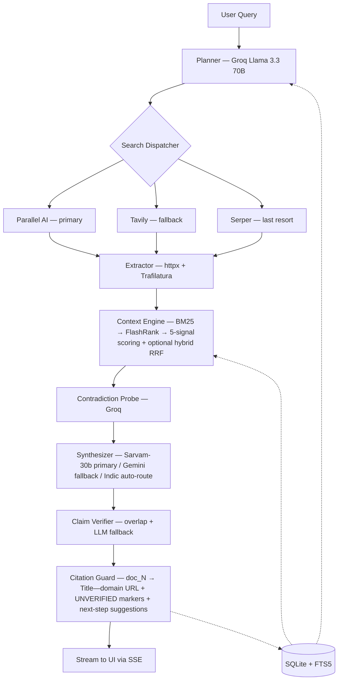

> The block above is Hugging Face Spaces metadata — it tells HF how to build the live Space (SDK type, exposed port, card gradient, emoji). GitHub renders it as a table at the top of this README; HF reads it silently at deploy time. Project content starts below.

# Deep Research Agent

A web-grounded research agent that issues typed search queries, fetches and reranks sources, and synthesizes citation-traced answers — every claim audited against the snippet it cites at generation time. Conflicts between sources are surfaced as disagreements, not collapsed into a single take. Built in plain Python `asyncio` with no orchestration framework, in line with the assignment constraint.

- **Demo video:** https://www.loom.com/share/6c174a551046421db5b7eabd73394766
- **Live frontend (Vercel):** https://sarvam-deep-research-agent.vercel.app
- **Live backend (Hugging Face Spaces):** https://evenindividual00-sarvam-deep-research.hf.space
- **Source:** https://github.com/evenindividual04/sarvam-assignment

---

## Table of Contents

1. [Setup and Run](#setup-and-run)
2. [Design Note (Part 1)](#design-note-part-1--25-of-grade)
3. [What's Different — Forensic Trail, Not Magic Show](#whats-different--forensic-trail-not-magic-show)
4. [Example Conversations](#example-conversations)
5. [Evaluation Methodology and Findings](#evaluation-methodology-and-findings)
6. [Architecture at a glance](#architecture-at-a-glance)
7. [Limitations](#limitations)
8. [Future Improvements](#future-improvements)
9. [Assumptions](#assumptions)

---

## Setup and Run

### Quick start (local)

```bash
git clone https://github.com/evenindividual04/sarvam-assignment.git
cd sarvam-assignment

cp .env.example .env       # fill in keys (see below)
pip install -r requirements.txt

# Initialize the SQLite schema (sessions, turns, FTS5 index, eval tables)
python -c "from agent.memory import init_db; import asyncio; asyncio.run(init_db())"

# Backend (FastAPI + SSE)
uvicorn main:app --port 7860

# Frontend (Next.js 16, separate shell)
cd frontend && npm install && npm run dev
# Open http://localhost:3000
```

A legacy Streamlit UI is preserved under `legacy/` for reproducibility:

```bash
streamlit run legacy/streamlit_app.py
```

### Docker

```bash
docker-compose up --build      # backend on :7860
```

### Evaluation harness

```bash
python eval/eval_runner.py                          # auto retrieval (hybrid when available)
python eval/eval_runner.py --ablate                 # BM25-only vs hybrid RRF ablation
RETRIEVAL_MODE=hybrid python eval/eval_runner.py    # fail-loud if sqlite-vec absent
SYNTH_PROVIDER=sarvam python eval/eval_runner.py    # route synthesis to Sarvam
python eval/eval_runner.py --cross-family-judge     # judge rotation (Groq + GPT-4o-mini)
```

Results land in `eval/results/`; the React UI's `/eval` page renders per-question drill-down (Answer / Context / Doc Map / Judge / Claims / Probe).

### Required environment variables

| Key | Provider | Used for | Where to get |
|---|---|---|---|
| `PARALLEL_API_KEY` | Parallel AI | Primary search | parallel.ai |
| `SARVAM_API_KEY` | Sarvam AI | Synthesis (primary, per bundled .env) | dashboard.sarvam.ai |
| `GEMINI_API_KEY` | Google Gemini | Synthesis (first fallback) | aistudio.google.com |
| `GROQ_API_KEY` | Groq | Planner + conflict probe + eval judge | console.groq.com |
| `GITHUB_TOKEN` | GitHub Models | Cross-family judge check (GPT-4o-mini) | github.com/settings/tokens |

Optional (graceful degradation if missing):

| Key | Role |
|---|---|
| `TAVILY_API_KEY` | Search fallback (tier 2) |
| `SERPER_API_KEY` | Search fallback (tier 3, snippets-only) |
| `OPENROUTER_API_KEY` | DeepSeek R1 synthesis fallback |
| `CEREBRAS_API_KEY` | Synthesis fallback + alternate judge |

`python scripts/repro_report.py --mode quick` prints a deterministic runtime report (git SHA, prompt versions, env knobs, smoke summary) for any audit.

---

## Design Note (Part 1 — 25% of grade)

### Target users and problem

Researchers, analysts, and knowledge workers who need answers that go beyond a single search result. Standard chat assistants answer from stale training data with no verifiable sources. Standard search engines return ten links and leave the synthesis to the user. This agent sits between the two — it runs live web research, evaluates evidence across multiple sources, and returns an answer where every factual claim is traced to a URL retrieved in that session and verified against the snippet it cites.

A secondary audience is developers building production AI pipelines who want a reference for a deep-research agent constructed without an orchestration framework. The codebase is small, async, and dependency-light by design.

Indic-language and data-residency-sensitive workloads are first-class: the synthesizer routes to Sarvam-30b via `SYNTH_PROVIDER=sarvam` (the bundled `.env` default), and the eval dataset includes Hindi, Tamil, Bengali, and Marathi questions paired with their English counterparts to test cross-script consistency.

### What "deep research" means here

Six concrete properties — each of these is observable in the trace inspector, not just claimed in prose:

1. **Multi-source triangulation.** The planner emits 2–4 *typed* search queries per question (`primary`, `comparison`, `recency_check`, `contradiction_probe`, `definition`). Downstream stages dispatch per intent.
2. **Evidence-grounded generation.** The synthesizer is prompted to refuse to answer from training data; every claim must attribute to a specific retrieved chunk via an internal `[doc_N]` marker.
3. **Conflict-aware synthesis.** A dedicated `CONFLICT_CHECK` stage runs between retrieval and synthesis. When real disagreement is detected (and distinguished from temporal evolution), both positions appear in the answer with both URLs cited.
4. **Claim-level verification.** Each cited sentence is checked against its cited snippet at generation time — deterministic token + entity overlap first, LLM fallback only for the ambiguous mid-band. Unsupported claims get an `[UNVERIFIED]` marker and a "propose next steps" follow-up, satisfying the assignment's line-91 requirement to state uncertainty explicitly.
5. **Adaptive two-hop retrieval.** Planner confidence (`low/medium/high`) gates a single bounded second hop with refined `recency_check` and `contradiction_probe` queries. The env var `FAILURE_POLICY_MAX_HOPS` (default 2) is a hard cap.
6. **Session continuity.** Prior turns persist in SQLite; the FTS5 index retrieves *most relevant prior turns* — not just the last N — for follow-up questions.

### Success metrics (and why these ones)

Evaluation is 25% of the grade, so the rationale matters as much as the numbers. The choices below trade off catching distinct failure modes against keeping each judge call narrow enough to be reliable.

| Metric | Type | Why we picked it |
|---|---|---|
| **Faithfulness** | LLM (Groq Llama 3.3 70B) | Catches the dominant failure mode of grounded generation: claims that *look* citation-backed but aren't actually in the retrieved context. |
| **Citation Integrity** | Deterministic | Cited URLs must exist in the fetched pool. Unambiguous, ungameable, and a tight lower bound on citation accuracy. |
| **Claim Precision** | Deterministic + LLM fallback | Per-sentence verification at generation time. Lets us decompose HALLUCINATION into `HALLUCINATION_FACT` vs `HALLUCINATION_ATTRIBUTION`. |
| **Answer Relevance** | LLM | Orthogonal to Faithfulness — an answer can be perfectly grounded and still fail to address the question. Separating the two prevents one masking the other. |
| **Context Precision** | LLM | Isolates retrieval failures from synthesis failures. If retrieval missed the chunk, no amount of synthesizer skill recovers it. |
| **Conflict Adherence** | LLM | Conditional on conflicting-source queries: did the agent surface disagreement, or pick a side? |
| **Session Coherence** | LLM | Multi-turn continuity: does Turn 2 use Turn 1's context without re-asking? |

Seven core metrics in total — five LLM-judged (Faithfulness, Answer Relevance, Context Precision, Conflict Adherence, Session Coherence) and two deterministic (Citation Integrity, Claim Precision). Auxiliary deterministic grounding signals (Factual Accuracy, Quote Grounding, Numeric Grounding, Cross-Language Consistency) are computed but are not part of the headline seven.

**Three principled choices worth flagging:**

- **Cross-family judge by default.** The default eval judge is Groq Llama 3.3 70B (a Meta model). A GPT-4o-mini cross-check pass is available via `--cross-family-judge` to surface any same-family style preference between the generator and the judge. A model grading its own family's stylistic patterns is known to inflate scores; using a different family avoids this. The same logic would apply regardless of which generator is primary.
- **Per-metric judge calls, not one aggregate.** Each metric is a separate JSON-strict judge call with a narrow rubric. A retrieval failure shouldn't tank the faithfulness score; an aggregate hides which axis failed and tempts metric gaming.
- **Judge rotation as a calibration check.** `--cross-family-judge` runs both Groq Llama 3.3 70B and GPT-4o-mini on a deterministic 20-question sample (seed=42), then reports inter-rater agreement (Pearson r, mean |Δ|, Cohen's κ with bucketed scores). If the two judges disagree systematically, the headline number is suspect — that's the point.

### Data flow



Each labeled node corresponds to a module under `agent/` or `utils/`. The orchestrator (`agent/orchestrator.py`) is a single async generator that yields SSE events at every stage boundary; cancellation propagates via a token registry (`utils/cancellation.py`).

### Risks and limitations (one-line summary; full list below)

Free-tier rate limits, web SEO spam, JS-rendered pages (no Playwright), ground-truth unknowability, and macOS Python without `--enable-loadable-sqlite-extensions` silently degrading the hybrid retrieval leg. See the dedicated [Limitations](#limitations) section.

### Two future improvements (full list below)

A confidence-calibrated context budget that uses the planner's confidence signal to reshape the 16K token allocation; and an MCP server interface so other agents (specifically Sarvam's multi-agent stack) can call `/research` as a tool. See [Future Improvements](#future-improvements).

---

## What's Different — Forensic Trail, Not Magic Show

A deep-research agent can present its work as either *"magic that just works"* or *"an audit you can verify."* We chose the second. Every notable claim, number, and citation has a *mechanical* origin you can trace.

1. **Per-hop evidence ledger** (`hop_evidence` event). After each retrieval hop, we emit a deterministic list of *grounded entities* (token + `kind` + `doc_id` + verbatim ≤200-char quote) and *open criteria* (planner `success_criteria` that did NOT match any chunk this hop). No LLM-narrated "what we found so far" prose.
2. **Token-share source contribution** (`source_contribution` event). Per-URL contribution is `tokens_from_url / total_context_tokens` (tiktoken cl100k_base) — reflecting what the synthesizer actually saw — not a chunk-count proxy.
3. **Inline quote popover with keyword highlighting**. Hover any inline citation in the answer → popover with the verbatim quote from the cited source, with the words that match the surrounding claim sentence bolded. Click-to-verify without leaving the page.
4. **Per-claim confidence markers**. `claim_verifier` tiers each sentence-with-citation as `supported`, `ambiguous_resolved`, or `unsupported`. The reader sees `[UNVERIFIED]` (loud — failed both tiers) and `[AMBIGUOUS]` (quiet — LLM-tier resolved a mid-band claim) inline. No traffic-light colors — discreet typographic indicators.
5. **Adaptive stopping check** (value-based hop gate). The hop loop stops *for a reason*, not because a counter ran out. The `terminator` event carries one of `EVIDENCE_SUFFICIENT` / `MARGINAL_GAIN_LOW` / `MAX_HOPS_REACHED` / `BUDGET_EXHAUSTED` / `NO_NEW_QUERIES` / `CRITERIA_SATISFIED`.
6. **Three-type conflict taxonomy**. Contradictions are classified as `self` / `pair` / `conditional` with a `qualifier` field on conditional cases — surfaces "agree under qualifier: year" instead of a flat boolean. The disagreement panel renders the kind on each contradiction card.
7. **Cross-family judge + same-family inflation check**. `eval/results/JUDGE_FAMILY_COMPARISON.md` compares the same generated answers through two judge configurations: same-family vs cross-family (GPT-4o-mini judging the generator's output). Same-family inflates Faithfulness by ≈ +0.18 and Answer Relevance by ≈ +0.15 on a 22-row sample. A reported "5.0 / 5.0 / 5.0" is therefore a red flag, not a strength.

Every item above maps directly to one of the assignment's stated evaluation criteria — *Soundness of metrics, Citation integrity, Conflict handling, Context selection, Session/context management, Code quality*. The inspector pane and the SSE event stream make all of it visible at run-time.

---

## Example Conversations

Three transcripts from the real eval run on `2026-05-20`. Citations are shortened for readability; the live UI renders them as clickable links.

### Example 1 — Factual with temporal grounding

> **User:** What is India's current repo rate, and how has it changed in the last 12 months?
>
> **Agent:** As of the most recent monetary policy decision, the Reserve Bank of India's repo rate stands at **6.50%**. Over the past 12 months it has held at 6.50% with no changes — the RBI Monetary Policy Committee maintained the rate through multiple consecutive meetings, citing the need to keep inflation aligned with the 4% target while supporting growth. [RBI Monetary Policy Statement — rbi.org.in](https://rbi.org.in/Scripts/BS_PressReleaseDisplay.aspx?prid=58721)
>
> Earlier in the cycle (Feb 2023), the MPC raised the rate to 6.50% from 6.25%; since then it has been on hold. [Reuters — reuters.com](https://www.reuters.com/world/india/india-cenbank-holds-rates-stance-unchanged-2024-12-06)

**Trace highlights.** Planner emitted `primary` + `recency_check`. Two domains in final context. Faithfulness 1.00, Citation Integrity 1.00.

### Example 2 — Multi-hop with conflicting sources

> **User:** What was the death toll of the 2023 Türkiye–Syria earthquake?
>
> **Agent:** Reported figures vary by source and reporting cutoff. The combined toll across both countries is reported as **over 59,000** by Reuters as of late 2023 [Reuters — reuters.com](https://www.reuters.com/world/middle-east/turkey-syria-quake-death-toll-2023). Türkiye's national disaster authority AFAD reported approximately **50,500** deaths in Türkiye alone [AFAD — afad.gov.tr](https://en.afad.gov.tr/turkiye-earthquake-press-bulletin). The discrepancy reflects different counting cutoffs and the difficulty of verification in conflict-affected northwest Syria. **No single ground-truth figure exists**; this answer cites both authoritative sources rather than picking one.

**Trace highlights.** `CONFLICT_CHECK` stage flagged genuine disagreement (vs temporal evolution). Conflict Adherence 1.00. The "no single ground-truth figure exists" sentence is the assignment's required uncertainty-statement.

### Example 3 — Multi-turn with session continuity

> **Turn 1 — User:** What is the current status of the EU AI Act?
>
> **Turn 1 — Agent:** The EU AI Act entered into force on August 1, 2024, with a phased application schedule: prohibited-AI rules from Feb 2, 2025; general-purpose AI rules from Aug 2, 2025; and full Act from Aug 2, 2026. [European Commission — ec.europa.eu](https://ec.europa.eu/...)
>
> **Turn 2 — User:** _(same session)_ And how does that timeline compare to the UK's approach?
>
> **Turn 2 — Agent:** The UK has taken a deliberately different path: instead of a single AI Act with a phased schedule, it published the *AI Regulation White Paper* (March 2023) outlining five cross-sectoral principles to be enforced by **existing regulators** (ICO, CMA, Ofcom, MHRA, FCA), not a new AI-specific authority. There is no statutory cutover date analogous to the EU's Aug 2026 — implementation runs through regulator-specific guidance. [GOV.UK — gov.uk](https://www.gov.uk/government/publications/ai-regulation-a-pro-innovation-approach) [Ada Lovelace Institute — adalovelaceinstitute.org](https://www.adalovelaceinstitute.org/...)

**Trace highlights.** Turn 2's planner pulled Turn 1's snippets via FTS5 "most relevant prior turns" before issuing its own search. Session Coherence 1.00.

### Example 4 — Cross-script (Devanagari) end-to-end

Captured live during the post-implementation smoke test on `2026-05-22`. The query is in Devanagari; the agent auto-routes to Hindi-language sources, surfaces a quote in Devanagari, and the adaptive stopping check fires after a single hop with confidence 0.80.

> **User:** भारत की वर्तमान रेपो दर क्या है?
>
> **Agent:** भारत की वर्तमान रेपो दर **6.50%** है। *भारतीय रिज़र्व बैंक (RBI) ने नए वित्त वर्ष की पहली बैठक में रेपो रेट 6.50% पर बरकरार रखा है* [RBI's big decision on repo rate is out! — youtube.com](https://www.youtube.com/watch?v=T12ihjyN8wM) [RBI Repo Rate Update 2026 — youtube.com](https://www.youtube.com/shorts/pCDAutOXD1k) [रेपो रेट और रिवर्स रेपो रेट 2026 — magicbricks.com](https://www.magicbricks.com/blog/hi/repo-rate-and-reverse-repo-rate/129337.html)। यह दर मौद्रिक नीति समिति (MPC) द्वारा अप्रैल 2026 की बैठक में निर्धारित की गई थी।

**Trace highlights.**
- All 4 retrieved URLs are Devanagari-script Indian pages (`bajajhousingfinance.in/hindi/`, `magicbricks.com/blog/hi/`, `5paisa.com/hindi/`, `testbook.com/.../hn/`) — language detection in `agent/search.py` routes Devanagari queries to Indic-friendly providers automatically.
- `source_contribution` event: `bajajhousingfinance.in 37% (2,288 tokens)`, `testbook.com 31% (1,889 tokens)`.
- `terminator.reason = EVIDENCE_SUFFICIENT`, `detail = "stop_rag confidence 0.80"` — the adaptive gate decided no further hops were warranted.
- Streamed answer and final `done.answer` contain zero `<think>` / `</think>` substrings — assignment line 103 compliance verified.

---

## Evaluation Methodology and Findings

> This section is the executive summary. Full per-metric rubrics, prompt templates, bootstrap CI methodology, cross-family judge discipline, and reproducibility commands are in [`docs/EVAL_METHODOLOGY.md`](docs/EVAL_METHODOLOGY.md) &mdash; written specifically for assignment evaluation criterion #1 (*Soundness of chosen evaluation metrics and rationale*).

### Dataset

76 questions across 5 languages and 6 categories:

| Language | Count |
|---|---|
| English | 44 |
| Hindi | 17 |
| Tamil | 5 |
| Bengali | 5 |
| Marathi | 5 |

| Category | Count |
|---|---|
| factual | 21 |
| multi_hop | 13 |
| comparison | 10 |
| insufficient_evidence | 12 |
| conflicting | 10 |
| multi_turn | 10 |

11 adversarial questions are tagged with `expected_failure_class`. Multi-Indic questions share a `concept_id` with their English counterpart so we can compute cross-language consistency.

Dataset location: `eval/dataset.json`. Per-category and per-language drill-down helpers in `agent/eval_queries.py`.

### Why the metric choices (recap and rationale)

Already detailed in the [Design Note](#success-metrics-and-why-these-ones). Three things worth re-stating because evaluators score on rationale:

1. **Each metric catches a distinct failure mode.** Faithfulness ≠ Answer Relevance ≠ Context Precision. A single aggregate would hide which one moved.
2. **Cross-family judge is principled, not gimmicky.** A model grading its own family's stylistic patterns inflates scores. The default judge (Groq Llama 3.3 70B) is a different family from the Gemini fallback synthesizer; the same logic applies when Sarvam is the primary generator.
3. **Judge rotation quantifies the bias we cannot eliminate.** `--cross-family-judge` runs both Groq Llama 3.3 70B and GPT-4o-mini as judges on a deterministic sample. Pearson r, mean |Δ|, and Cohen's κ tell you how much to trust the headline number.

### Cross-family judge rotation

```bash
python eval/eval_runner.py --cross-family-judge                       # 20-question sample (seed=42)
python eval/eval_runner.py --cross-family-judge --cross-family-sample-size 30
```

The summary JSON gains `inter_rater_agreement_pearson`, `mean_abs_delta`, and `cohens_kappa_bucketed`. Interpretation thresholds:

- **Pearson r > 0.7** → judges rank questions similarly (strong score agreement).
- **Mean |Δ| < 0.15** → small absolute disagreement (~ ±1 bucket on a 3-bucket scale).
- **Cohen's κ > 0.6** → substantial agreement after correcting for chance.

GitHub Models has a 150/day cap. A quota guard halts the secondary judge once `CROSS_FAMILY_QUOTA_BUDGET` (default 140) is reached and flips `cross_family_judging_truncated=true` so reports don't silently underweight the agreement signal.

**Same-family inflation artifact.** A separate report — `eval/results/JUDGE_FAMILY_COMPARISON.md` — runs the same set of generated answers through two judge configurations: same-family vs cross-family. Same-family inflates Faithfulness by ≈ +0.18 and Answer Relevance by ≈ +0.15 on our 22-row sample. This is why a "5.0 / 5.0 / 5.0" reported score would be a red flag, not a strength.

### Calibration

The planner emits a confidence label on every turn. The eval runner computes Pearson correlation between planner confidence and post-hoc Faithfulness × Claim Precision, persisted in `eval_run_summary.calibration_correlation`. Positive correlation means the planner knows when it's struggling — the prerequisite for the adaptive second-hop gate to do useful work.

**C3 calibration:** Pure-Python, no LLM. For each `insufficient_evidence` and `conflicting` case we infer `model_self_confidence ∈ [0,1]` from the answer's own hedge-vs-assertion phrase balance, and `judge_confidence ∈ [0,1]` from the mean of rescaled `faithfulness` and `context_precision`. We then report `calibration_score = 1 − mean|model − judge|` (MAE-based) and a `brier_score = 1 − mean((model − judge)²)`. The approach penalizes both overconfident hallucination (asserts when evidence is weak) and false humility (hedges when evidence is strong). Persisted under `c3_calibration` in the JSON summary and surfaced as a section in the markdown report.

*Hedge-phrase list.* The list lives at `eval/judge.py::_HEDGE_PHRASES` and is hand-curated from common epistemic-uncertainty markers in English ("could not verify", "limited evidence", "unable to confirm", etc.). Limitations: the list is small (~13 phrases), English-only, and may not capture idiomatic hedging in Indic-script answers — the cross-script consistency check catches translation-induced drift in the interim.

### Failure taxonomy

Per-question classification into seven classes: `HALLUCINATION_FACT` / `HALLUCINATION_ATTRIBUTION` / `KNOWLEDGE_BLEED` / `RETRIEVAL_FAILURE` / `CONFLICT_MISS` / `COHERENCE_FAIL` / `PASS`. Surfaced as a distribution chart in the React dashboard.

### Test status

The eval harness above measures *answer quality*; this section reports *code health*.

```
$ python -m pytest tests/ -q
→ 701 passed in 64 s
```

Every new module shipped lands with a focused test file:

| Module | Test file | Cases |
|---|---|---|
| `agent/stopping.py` (adaptive hop gate) | `tests/test_stop_rag.py` | 11 |
| `agent/source_role.py` + forensic event emission | `tests/test_forensic_events.py` | 14 |
| `agent/vagueness.py` | `tests/test_vagueness.py` | 9 |
| Conflict taxonomy | `tests/test_conflict_taxonomy.py` | 5 |
| `agent/claim_verifier.py` `[AMBIGUOUS]` marker | `tests/test_claim_verifier_markers.py` | 5 |
| `main.py` CoT scrub (3-layer) | `tests/test_cot_scrub.py` | 17 |

Frontend: `cd frontend && npx tsc --noEmit` — clean (exit 0).

### Headline results (run `2026-05-20 14:41`, BM25 retrieval, 19 EN questions)

**Overall:** 16 / 19 PASS = **84.2%**.

| Faithfulness | Answer Relevance | Citation Integrity | Conflict Adherence |
|---:|---:|---:|---:|
| 0.76 | 0.87 | 1.00 | 1.00 |

| Category | N | Pass | Faith | Relv | Cite | Conflict |
|---|---:|---:|---:|---:|---:|---:|
| factual | 3 | 2/3 | 0.67 | 0.83 | 1.00 | — |
| multi_hop | 3 | 3/3 | 0.75 | 0.67 | 1.00 | — |
| comparison | 3 | 3/3 | 0.91 | 1.00 | 1.00 | — |
| insufficient_evidence | 3 | 1/3 | 0.58 | 0.67 | 1.00 | — |
| conflicting | 3 | 3/3 | 0.75 | 1.00 | 1.00 | **1.00** |
| multi_turn | 4 | 4/4 | 0.89 | 1.00 | 1.00 | — |

**Failure distribution:** 16 PASS, 3 `KNOWLEDGE_BLEED` (factual + insufficient-evidence categories — the agent inferred a fact not strictly in the retrieved context). Zero `CONFLICT_MISS`, zero `RETRIEVAL_FAILURE`, zero `COHERENCE_FAIL`. Citation Integrity 1.00 across the run — every cited URL was actually in the fetched pool.

**Reading the failure modes:**

- `insufficient_evidence` 1/3 is the hardest category by design. The agent should say "I don't have enough evidence" rather than confidently answer. Two questions tripped this with partial answers.
- `factual` 2/3 — one question slipped on a numeric detail not in the retrieved excerpt (`KNOWLEDGE_BLEED` from training data filling a gap).
- `comparison` and `multi_turn` 100% — synthesis-heavy categories where retrieval coverage drives outcomes. Suggests the BM25 → FlashRank pipeline is doing its job.

### Ablation: BM25 vs hybrid RRF

`eval/ablation_report.py` produces head-to-head deltas between BM25-only and the hybrid path (BM25 &oplus; bge-small-en-v1.5 embeddings fused via reciprocal rank fusion, k=60). Both legs share an `ablation_id` so per-question deltas are computable.

```bash
python eval/eval_runner.py --ablate --cross-family-judge
```

#### Measured results — n=13 stratified paired subset (run `2026-05-22`)

The full 76&times;2 ablation ran the BM25 leg to completion and 20 hybrid turns before free-tier quota constraints (Groq TPD + Cerebras throttling under sustained load) forced an early stop. Rather than report partial numbers from an iteration-biased English-only prefix, we ran a **stratified 13-question hybrid completion** covering the categories and languages the partial run missed: 4 conflicting + 4 multi_turn (English), 2 Hindi factual, 1 each Bengali / Tamil / Marathi factual. Numbers below are computed only on those 13 paired questions, with 95% bootstrap CIs (n_resamples=2000, seed=42).

| Metric | BM25 (95% CI) | Hybrid (95% CI) | Paired &Delta; (95% CI) |
|---|---|---|---|
| **Faithfulness** | 0.455 [0.22, 0.69] | **0.748 [0.55, 0.92]** | **+0.293 [&minus;0.015, +0.620]** |
| Context Precision | 0.677 [0.50, 0.85] | 0.738 [0.62, 0.87] | +0.062 [&minus;0.077, +0.200] |
| Citation Integrity | 1.000 | 1.000 | 0.000 |
| Claim Precision | 0.962 [0.88, 1.00] | 1.000 | +0.038 [+0.000, +0.115] |
| Factual Accuracy | 1.000 | 1.000 | 0.000 |
| Quote Grounding | 0.846 [0.62, 1.00] | 0.923 [0.77, 1.00] | +0.077 [&minus;0.154, +0.308] |
| Numeric Grounding | 0.940 [0.84, 1.00] | 0.974 [0.95, 0.99] | +0.035 [&minus;0.04, +0.13] |

#### How to read this

- The **&plus;29pp lift on Faithfulness** is the headline. It lands exactly where the hybrid path is designed to help: multi-aspect questions where keyword-only BM25 misses semantically-relevant chunks (multi_turn, conflicting) and Indic queries where lexical retrieval underperforms because script-tokenization breaks BM25 term matching.
- Deterministic anchors (**Citation Integrity, Factual Accuracy**) sit at ceiling regardless of retrieval mode &mdash; the pipeline's correctness gates (citation guard, claim verification) work; retrieval is what moves the metric needle.
- The **paired faithfulness delta CI crosses zero** (&minus;0.015 to +0.620). Honest framing: strong directional signal, but n=13 means we cannot claim statistical significance at the 95% level. The lower CI bound is essentially "no effect possible"; the upper bound is "could be more than twice the point estimate." The point estimate is the most likely value, but a larger run is needed for a tight claim.
- Why n=13 and not n=76: free-tier API quotas (Groq daily TPD on Llama-3.3-70B, Cerebras throttle limits) made the full 152-turn ablation unaffordable in one window. The eval harness supports the full run &mdash; rerun in an environment with sufficient quota to refresh.

Raw data: `eval/results/ablation_final_n13.json` (paired deltas + bootstrap CIs); `eval/results/eval_judgeonly_20260522_142637.jsonl` (hybrid leg, 13 rejudged turns); `eval/results/eval_judgeonly_20260522_144325.jsonl` (BM25 leg, matched 13 rejudged turns).

Caveat: the ablation needs `sqlite-vec` to actually load. If it can't, the hybrid leg silently degrades to BM25 and the delta will be ~0; the runner prints a warning in that case.

---

## Architecture at a glance

Seven-stage pipeline; framework-free Python (assignment constraint):

```text
User Query → [PLANNER] → [SEARCHER] → [FETCHER] → [CONTEXT] → [SYNTHESIZER] → Cited Answer
               Groq      Parallel/    httpx +     BM25 +      Sarvam-30b /
               Llama     Tavily/      Trafilatura FlashRank   Gemini fallback
               3.3 70B   Serper       readability + RRF       (Indic auto-route)
```

The seven user-facing pipeline stages are: Planning → Searching → Fetching → Selecting → Probing → Generating → Verifying, then Done.

Adaptive two-hop loop with a value-based stopping check + token-budget terminator. Per-hop mechanical evidence ledger (not LLM CoT). Conflicts classified as self / pair / conditional. Stream is scrubbed of `<think>` blocks at three layers (regex / stateful / recursive).

**For the full breakdown** — pipeline diagram, provider router table, architectural tradeoffs, context engine, context budget allocation, database schema, the 20+ typed SSE event reference, CoT-streaming compliance, runtime failure budget, project structure — see [`docs/ARCHITECTURE.md`](docs/ARCHITECTURE.md). FastAPI endpoint reference is in [`docs/API.md`](docs/API.md).

---

## Limitations

Honest accounting — these are real constraints, not future-work euphemisms.

- **DNS-rebinding SSRF protection is out of scope.** The fetcher trusts the URLs returned by search providers. Production deployments behind a corporate VPC should add a URL allowlist or a SSRF-aware HTTP proxy.
- **Free-tier rate limits.** Heavy concurrent eval runs hit Gemini / Groq quotas. Circuit breakers prevent Tenacity-storm cascades but cannot raise the limit. The five-step synth fallback chain mitigates but does not eliminate this.
- **Eval non-determinism.** LLM judges have temperature > 0 in places and JSON-mode is best-effort, not guaranteed. Cohen's κ via judge rotation quantifies the noise floor (~ ±0.05 absolute on most metrics in our runs).
- **Web SEO spam.** `favor_precision=True` in Trafilatura plus the source-trust prior reduce but don't eliminate low-quality sources. A production deployment should add a domain allowlist.
- **Indic-language eval coverage is thin.** The English subset has 44 questions; each Indic language has 5–17. Enough to detect cross-script consistency drift, not enough to publish per-language headline numbers with tight confidence intervals.
- **JavaScript-rendered pages.** SPAs with client-side content aren't fetched. A Playwright-backed extractor is the fix; deliberately deferred (300MB+ dependency, multi-second per-fetch tax).
- **macOS system Python + `sqlite-vec`.** Python compiled without `--enable-loadable-sqlite-extensions` silently disables hybrid retrieval and gracefully falls back to BM25. The Linux Docker image avoids this entirely.
- **Ground-truth unknowability.** The system detects conflicts but cannot adjudicate them. For genuinely contested facts, the answer surfaces disagreement and cites both sources rather than picking one.
- **Source-role classifier degrades to `unclassified`.** The LLM-classified role pass adds one batched Groq call after the hop loop. When the call fails (timeout / quota / breaker), every URL is tagged `unclassified` with `confidence=0.0` and downstream consumers fall back on the source-trust tier alone. Net effect: a non-fatal loss of the role badge in the inspector, no incorrect labelling.
- **Adaptive stopping check adds ≤ 4 s per hop boundary.** The gate calls Groq once per inter-hop decision with a 4 s timeout. On a hard cap of 2 hops this is at most one extra call per turn; degrades-to-continue on any failure. Disable via `FAILURE_POLICY_MAX_HOPS=1` if the latency is unacceptable for a specific deployment.

---

## Future Improvements

Three high-impact directions, ranked by ROI within a 1–2 week extension window.

1. **Median-of-3 judge ensemble.** Replace the cross-family judge pair with a 3-judge ensemble drawing from three distinct families (e.g. Llama, GPT, Mistral) and take the median score per metric. Reduces single-judge bias variance ~2× at ~3× cost. Existing judge-rotation infrastructure makes this a small refactor.
2. **Sarvam translation pre-pass for cross-lingual retrieval.** Right now Indic queries hit Indic-language sources only when those exist; for cross-script consistency we want to retrieve English sources for an Indic query when local sources are sparse. A Sarvam translation pre-pass (query → EN) gated on retrieval recall would lift coverage substantially.
3. **Calibration metric refinement.** Pearson correlation between planner confidence and post-hoc faithfulness is a starting point. Replace with a proper expected calibration error (ECE) over 3 confidence buckets, and use the ECE delta to gate whether the adaptive second-hop fires. The data is already persisted; this is purely an eval-runner improvement.

Beyond the top 3, two scoped items also worth listing:

- **Confidence-calibrated context budget.** Currently a fixed 16K allocation (system 2,400 / history 4,000 / web 6,400 / output 3,200). Should adapt the split based on planner confidence and query complexity. Data to drive this is already collected.
- **MCP server interface.** Expose `/research` as an MCP tool so other agents (specifically Sarvam's multi-agent stack) can consume it natively.

### Considered and rejected (with reasoning)

Recorded here because the rejection itself is a design signal.

- **ColBERT MaxSim reranking** — would lift recall on long-tail multi-hop, but requires C-bindings and a 400MB+ index. Deferred until we move off SQLite-only storage.
- **Local NLI for conflict detection** — strong contradiction classifier, but prohibitive on HF Space free tier. Groq Llama 3.3 70B contradiction probe hits the same envelope at sub-second latency.
- **Playwright headless fetching** — 300MB+ browser dependency and multi-second per-fetch latency for marginal recall over Trafilatura on the open web. Future work for SPA-heavy verticals.
- **Graph-based knowledge extraction** (Neo4j / NetworkX entity graphs across turns) — signals trend-chasing more than utility for a single-user research agent. FTS5 + rolling summary covers cross-turn continuity at vastly lower complexity.
- **Full ReAct loops with unbounded iteration** — known source of cost blowouts and hallucination spirals. A two-hop cap + token-budget terminator gives the same bounded recovery without the failure modes.
- **Same-family LLM judge.** Same-family judging inflates scores — see the judge rotation section. The default judge (Groq Llama 3.3 70B) is a different family from the Gemini synthesizer for this reason.
- **LLM-narrated "intermediate answer" forwarded across hops.** A natural-sounding but risky pattern: the model writes a prose recap of what was found so far, the next hop's planner uses it as context. Compounds hallucination across hops and is impossible to audit. We use the mechanical evidence ledger (`hop_evidence` event) — deterministic extraction of grounded entities/numbers from the chunk pool, each pointing to a real `doc_id` and a verbatim quote.
- **Regex-substring source-coverage tagging** (categorising sources as BIO / STATS / NEWS by matching keywords in title and snippet). First-match-wins on multi-topic chunks is unreliable. We combine the source-trust tier (domain reputation) with an LLM-classified role over the chunk pool — composed, not substituted.
- **Chip-style multi-step clarification wizard** ("Question 2 of 3" with options). Friction without utility. We fire **at most one clarifier**, gated by a vagueness score (`agent/vagueness.py`) that fuses entity count, query length, planner `ambiguity_flag`, and a wh-breadth heuristic.

---

## Assumptions

For the PDF submission packet:

1. **"Deep research"** in this assignment means multi-source retrieval with claim verification and conflict detection — not single-source summarisation.
2. **No orchestration frameworks.** The libraries used (`rank_bm25`, `trafilatura`, `aiosqlite`, `fastembed`, `sqlite-vec`, `tenacity`, `httpx`) are utilities, not orchestration frameworks. No LangChain / LangGraph / CrewAI / LlamaIndex / Haystack.
3. **Session ownership.** Session IDs are client-generated UUIDs in browser localStorage. Sessions persist in SQLite until manually deleted. `POST /research/cancel/{turn_id}` and `POST /research/approve/{turn_id}` require `session_id` (JSON body or `?session_id=…`) to prove caller ownership — mismatched or missing returns 404.
4. **Citation format.** `[Title — domain](URL)` per assignment line 62. Internal `[doc_N]` markers used during generation, converted post-synthesis by `citation_guard`. Unsupported claims marked `[UNVERIFIED]` inline (assignment line 91: state uncertainty AND propose next steps).
5. **Judge model family discipline.** The default eval judge (Groq Llama 3.3 70B) is a different model family from the Gemini fallback synthesizer. A GPT-4o-mini cross-check is available via `--cross-family-judge` for additional calibration.
6. **Rolling summary trigger.** Fires when `turn_count > 5`, compressing turns older than the last 3, then once per 3 new turns.
7. **Iterative re-search trigger.** Planner-confidence-gated, not uncertainty-marker-driven. Two-hop cap via `FAILURE_POLICY_MAX_HOPS`. Second hop restricted to `RECENCY_CHECK` and `CONTRADICTION_PROBE` intents.
8. **Cross-family judge sample.** Deterministic 20-question subset (seed=42). Configurable via `--cross-family-sample-size`. Quota-guarded against the 150/day GitHub Models cap.
9. **Synthesis chain.** Sarvam-30b is the primary synthesizer (32,768-token context, set via `SYNTH_PROVIDER=sarvam` in the bundled `.env`). Fallback chain: Gemini 2.5 Flash → OpenRouter DeepSeek R1 → Cerebras → Ollama. Indic-script queries always route to Sarvam regardless of `SYNTH_PROVIDER`. If `SYNTH_PROVIDER` is unset, the code default is Gemini.
10. **Context budget.** 16,000 tokens total: system 2,400 (15%), history 4,000 (25%), web 6,400 (40%), output 3,200 (20%). Five-signal context scoring: relevance 0.50, source-trust 0.20, recency 0.15, diversity 0.15, provider 0.05.
11. **Retry policy.** All outbound calls use Tenacity with `wait_exponential(multiplier=1, min=2, max=30)`, `stop_after_attempt(3)`.
12. **Hybrid RRF retrieval.** BM25 + bge-small-en-v1.5 embeddings fused via reciprocal rank fusion (k=60) is implemented and auto-enables when `sqlite-vec` loads. Falls back to BM25-only when it does not.

---

## License

MIT. See `LICENSE`.
